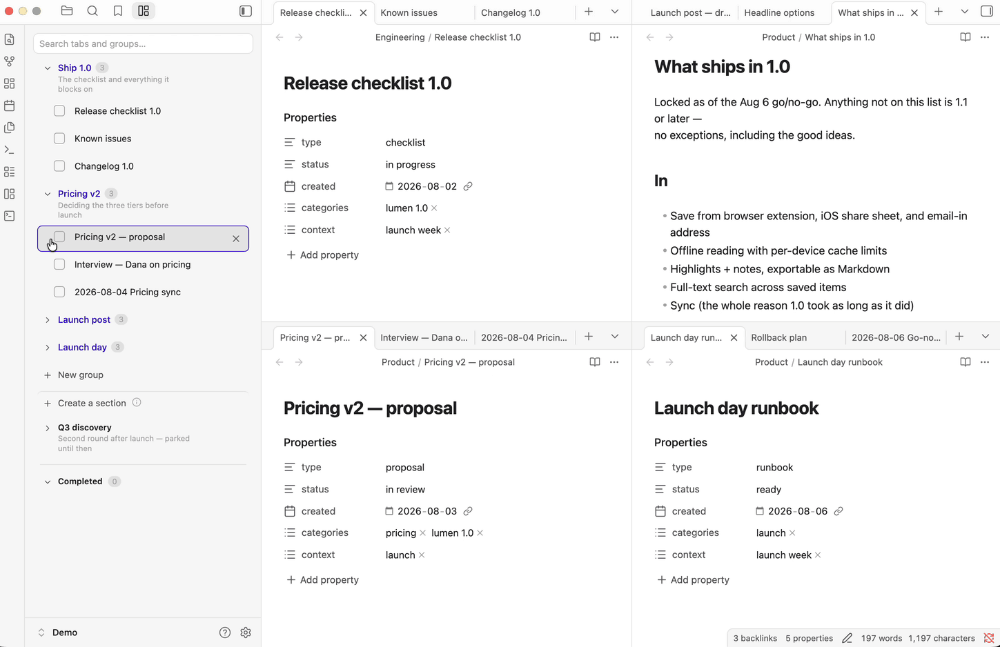
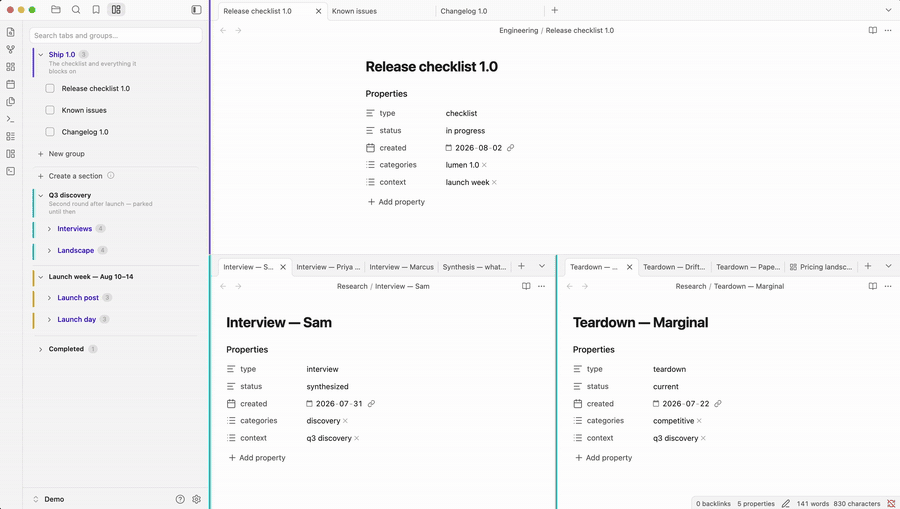
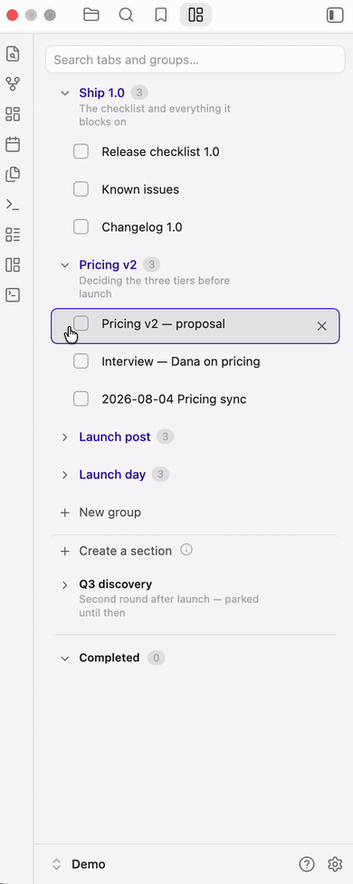

# Working tabs

Your open tabs, organized by what you're working on *right now* — not by folder, and not by layout. Inspired by Workona, built for Obsidian.

<p align="center">
  
</p>

**Colour-code your groups and sections too.** Every one is auto-assigned a colour, drawn as a stripe down its pane's left edge and a matching bar on its sidebar row — so you can tell at a glance which pane belongs where. File a group into a section and it takes on that section's colour.

<p align="center">
  
</p>

## Why

Arranging *how* open tabs render — columns, continuous scroll, and the like — is a layout problem. It doesn't solve the actual one: **you have twelve tabs open across three panes and no way to say "these six belong together, tuck them away, and give me back my screen."**

Working tabs is task-and-timeframe oriented, not layout-oriented:

- **Tabs-as-tasks.** A tab stays open because the work behind it isn't done. So a group of tabs is a unit of in-progress work, not just a pile of panes — closing it out is *completing* it, and completed groups sit in a recoverable Completed list instead of just vanishing.
- **Timeframe over project.** Your notes are already organized by project or topic — that's what your vault's folders and links are for. What they don't capture is *when* something matters: this week's research, a deadline you're heads-down on, a sprint that ends Friday. Sections exist for that — a place to park related groups for as long as they're relevant, then hide the whole thing in one click once the timeframe's over, without deleting anything.
- **Every pane is already a group.** There's no "create a group" step to remember. Open some tabs in a pane and Working tabs has already named it, tracked it, and listed it in the sidebar — organizing it into a section or renaming it is optional, not required up front.

## In practice

Two shapes this tends to take:

**Notes, by timeframe.** A section per sprint, deadline, or research push; the groups inside it are the threads of work you're actually holding open. When the timeframe ends, hide the section and the whole thing goes quiet in one click.

**Terminals, by what they're doing.** If you run terminals in your vault — say with [Terminus](https://community.obsidian.md/plugins/terminus) — they pile up fast, and they aren't interchangeable. Three long-lived Claude Code sessions you're actively talking to are a different kind of thing from the throwaway shells running `npx expo run:ios` or `astro build`. Put each kind in its own pane and you already have two groups: one you keep in view, one you hide until a build fails.

Hiding matters here specifically because it doesn't close anything — the pane is tucked out of sight, not torn down, so every process inside it keeps running while you get the screen space back. (Completing a group *does* close its pane, which ends whatever was running in it.) Terminal tabs are tracked for as long as Obsidian stays open; unlike note tabs, they can't be reopened after a restart, since the underlying processes don't survive one either.

## Features

### Groups
- Every pane of tabs in the main workspace is automatically a group — no manual creation step.
- Hover a group for quick actions: hide the pane, mark it complete, or open its menu. Click the row to reveal its pane if it's already open, or reopen it if it's dormant.
- **Open in...** split right, split down, new window, or new tab — matching Obsidian's own placement vocabulary. Opening into an already-occupied pane merges the two groups together.
- Rename inline (double-click or F2) and add an optional description shown under the title.
- **Hide a group** to tuck its pane away without closing it — the tabs stay open in the background, just out of view, and unhiding brings them right back.
- **Colour coding** ties a pane to its place in the sidebar: every group and section is auto-assigned a colour, drawn as a stripe down the pane's left edge and a matching bar on the sidebar row. Groups follow their section's colour, so filing a group into a section adopts it — even one you'd recoloured by hand — and dragging it back out restores its own. Pick "Colour" on any group or section to override, "No colour" to opt one out, or "Automatic" to go back to following along. Turn the whole thing off in settings without losing the colours you picked.
- **Closing a pane never deletes its group** — whether you use the sidebar's "Close group" or Obsidian's own tab-strip menu ("Close all", closing the last tab, closing the split), the group just goes dormant with its tab list intact, ready to reopen. Deleting it is always a deliberate choice.
- **Complete a group** when the work is done: its pane closes, but the group and its tab list move to Completed, fully restorable later. A per-tab "done" checkbox lets you check off individual tabs without completing the whole group.

<p align="center">
  
  <br>
  <em>Check tabs off as you finish them — the group completes itself and moves to Completed. Sections keep what's left filed by timeframe.</em>
</p>

### Sections
- Fold related groups together under one collapsible header — by timeframe, sprint, or whatever grouping makes sense for how you work.
- **Hide a section** to tuck away every group inside it at once, without touching each group's own hidden state — unhiding the section restores exactly what was hidden before.
- Sections always sort below your ungrouped, currently-open groups, so the top of the panel stays focused on what's live right now.

### Everything else
- **Drag and drop** to reorder groups, move tabs between groups, or file groups into sections.
- **Search** across tab and group titles, auto-expanding whatever matches.
- **Keyboard navigation**: arrow keys to move, Enter to open, F2 to rename, Delete to remove.
- **Restart-safe**: reopens matching tabs by file path after Obsidian restarts, and follows file renames so a group never silently loses track of a note.
- **Beyond notes**: tracks any pane — Terminus terminals, the Web Viewer, canvases, any other plugin's view — not just files. Titles set by another plugin's own UI (renaming a terminal tab, a browser tab's title loading in) are picked up too.

## Commands

| Command | Does |
|---|---|
| Open sidebar | Reveals the Working tabs panel |
| Toggle hide tab bar | Quick on/off for the "Hide tab bar" appearance setting, without opening Settings |

## Settings

| Setting | Description |
|---|---|
| Confirm before completing a group | Ask before marking a group done. Turn off once you trust it — completed groups can still be restored |
| Long titles | Truncate titles and descriptions with an ellipsis, or wrap them to multiple lines |
| Colour code groups and sections | Show each group's colour as a stripe on its pane and a bar in the sidebar. Off hides every stripe without forgetting your picks |
| Hide tab bar | Hide Obsidian's native tab-header row across every pane, for a cleaner look |

## Installation

1. Open **Settings → Community plugins** in Obsidian.
2. Click **Browse**, search for **Working tabs**, and click **Install**.
3. Click **Enable**. The panel opens in the left sidebar the first time you turn it on.

## Development

```bash
npm install
npm run dev    # watch mode with source maps
npm run build  # production bundle
```

## License

MIT, see [LICENSE](LICENSE).
